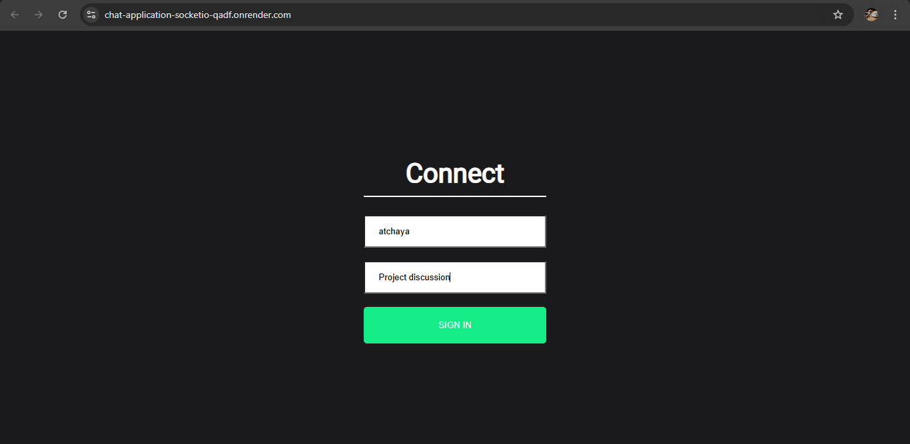
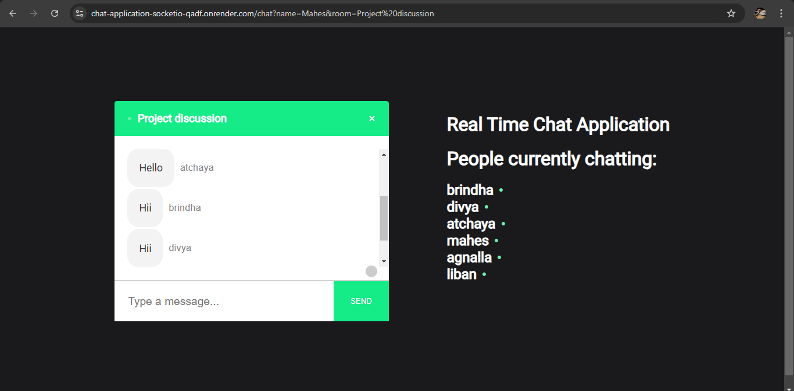

# Chat Application

Chat application built using **React.js**, **Node.js**, **Express.js**, and **Socket.io**. This application allows users to join chat rooms and exchange messages instantly, showcasing real-time communication features.

## Installation

Clone the repository:
   ```bash
   git clone https://github.com/Balaatchayar/Chat-Application
   ```

Install & Start backend:
```bash
cd server
npm install
npm start
```
Install & Start Frontend:
```bash
cd ../client
npm install
npm start
```
- Users can either create a new chat room or join an existing one.
- Users can send text messages in the chat room.
  




- Messages appear instantly for all users in the same chat room.
- Multiple users can join and interact in the same chat room simultaneously.
- All messages are exchanged in real-time, with no delays.

  
  


